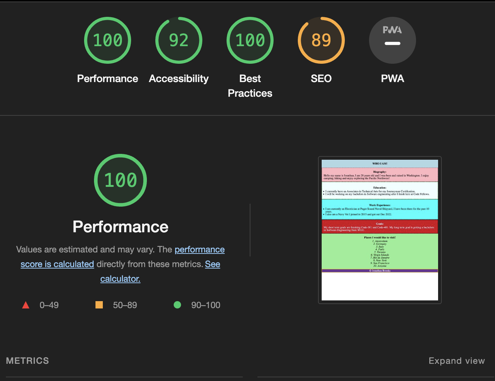

# LAB - 02

## About Me Quiz

This website displays prompts that ask the user yes and no questions about me the author. In addition the prompts include a guessing game and give your score at the end displaying how many questions you have gotten correct.

Author: Jonathan Brooks

### Reflections and Comments

This was a challenging lab to incorporate the "toLowerCase and toUpperCase functions". In addition having the extra function to add a variance of "yes / y" was interesting to incorporate

### Lighthouse Accessibility Report Score

## link for website [Here](https://jonbrooks01.github.io/class-201-lab02/)

Credited by Code Fellows 2023